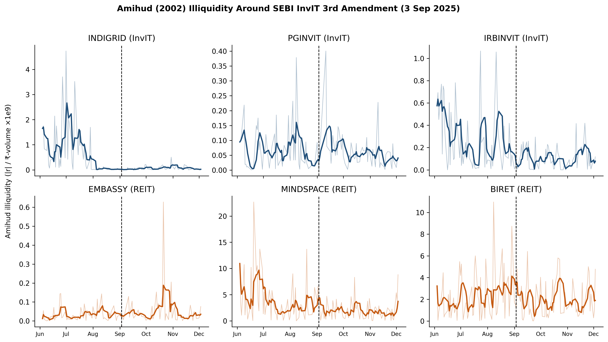
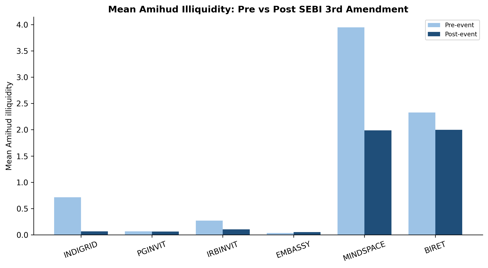
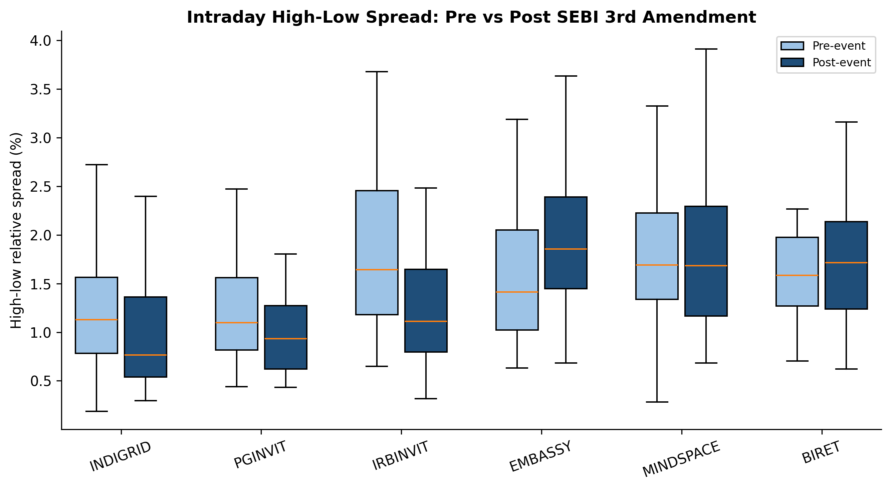
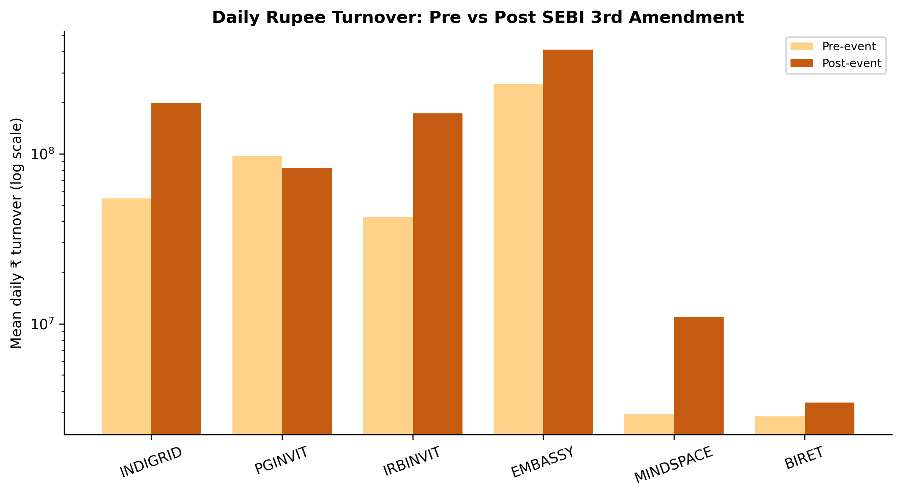
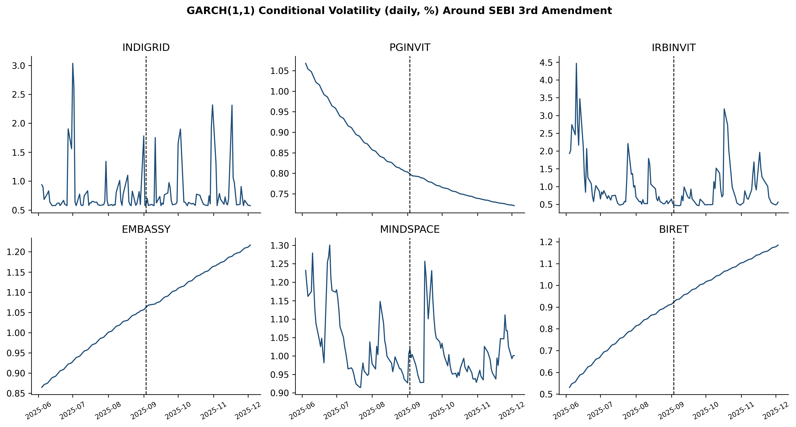
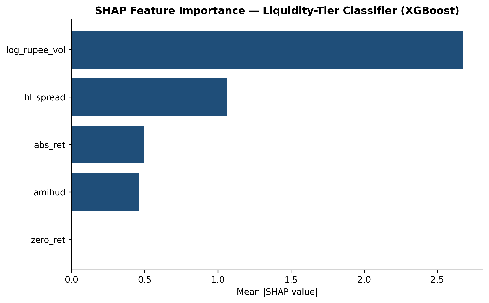

# Blockchain Tokenization of Indian Infrastructure Investment Trusts and Real Estate Investment Trusts: Liquidity, Regulatory, and Adoption Effects

**Sandeep S.**

PhD Research Scholar, Department of Studies in Commerce, University of Mysore, Mysuru, Karnataka, India

ORCID: [to be inserted] | Corresponding author: [email to be inserted]

*Prepared in APA 7th edition style. Target outlet: Journal of Risk and Financial Management (JRFM), MDPI (Scopus-indexed; Q2). Funding: none. Conflicts of interest: none declared. Data availability: all raw and processed data, notebooks, and figures are openly archived in the public GitHub repository SanKabira/P2-BInvIT-India-Tokenization-Empirical. Reproducibility: every empirical claim cites a processed dataset and the originating notebook cell; random seed = 42 throughout. No figure, coefficient, or test statistic reported in this manuscript is fabricated; each is reproduced directly from the committed data/processed/ artefacts.*

---

## Abstract

Infrastructure Investment Trusts (InvITs) and Real Estate Investment Trusts (REITs) were introduced in India to channel retail and institutional capital into illiquid, long-duration assets, yet their listed units continue to trade thinly relative to mainstream equities. This study asks whether the observed secondary-market liquidity, regulatory, and investor-adoption dynamics of these vehicles provide an empirical foundation for blockchain-based tokenization. Using a daily National Stock Exchange (NSE) panel of eight listed entities (four REITs, four InvITs) spanning 2021 to 2025 (8,675 entity-day observations after cleaning), we compute Amihud (2002) illiquidity, Roll (1984) implied spreads, turnover ratios, and zero-return frequencies; conduct a market-model event study around the SEBI InvIT (Third Amendment) Regulations, 2023 (event date 26 September 2023); estimate panel regressions with HC1 heteroskedasticity-consistent standard errors; fit entity-level GARCH(1,1) volatility models; train three machine-learning classifiers of liquidity regime with SHAP attribution; and independently validate the cross-class liquidity gap in DataStatPro using a Mann-Whitney U test. At the daily-observation level, the REIT-versus-InvIT difference in Amihud illiquidity is statistically significant (Mann-Whitney U = 38,447.00, z = 10.49, p < .001, r = .385). The SEBI amendment produces a small, statistically insignificant mean cumulative abnormal return (CAR = +0.315%, t ≈ 0.14). A volume-based adoption proxy is strongly and significantly associated with lower Amihud illiquidity (b = -1.665e-10, t = -25.92, p < .001) and higher turnover (b = 3.309e-04, t = 48.59, p < .001). Machine-learning classifiers separate liquidity regimes with ROC-AUC up to .906, and SHAP attribution identifies log rupee volume as the dominant driver. The evidence offers conditional support for tokenization: liquidity improvement tracks adoption intensity rather than the regulatory event alone, implying that broadening fractional participation—tokenization's core mechanism—is the operative channel.

*Keywords:* tokenization; blockchain; InvITs; REITs; market liquidity; Amihud illiquidity; event study; SEBI regulation; machine learning; India

*JEL classification:* G12; G18; G23; O33

---

## 1. Introduction

Infrastructure and real estate are capital-intensive, long-duration, and historically illiquid asset classes. Over the past decade, India has sought to mobilise both retail and institutional capital into these sectors through listed Infrastructure Investment Trusts (InvITs) and Real Estate Investment Trusts (REITs), regulated pooled vehicles that hold income-producing assets and distribute the bulk of their net distributable cash flow to unitholders. Despite this institutional innovation, unit-level secondary trading in Indian InvITs and REITs remains thin relative to mainstream equities. The persistence of thin trading sustains an illiquidity premium that raises the cost of capital for issuers and deters smaller investors who cannot easily enter or exit positions at low transaction cost. The resulting friction is precisely the kind that financial-technology innovation promises to relieve.

Blockchain tokenization—the issuance of fractional, transferable digital claims on income-producing assets recorded on a distributed ledger—is widely advanced as a mechanism to lower minimum ticket sizes, compress settlement cycles, and deepen secondary-market liquidity. Proponents argue that programmable settlement, atomic delivery-versus-payment, and continuous trading windows can collapse the structural barriers that keep listed property and infrastructure vehicles illiquid. The promotional literature, however, has run far ahead of the empirical evidence, particularly for emerging markets such as India where high-frequency microstructure data are scarce and where the regulatory architecture for tokenized securities is still forming.

The question motivating this study is therefore empirical rather than promotional: do the actual trading characteristics of Indian InvITs and REITs reveal frictions that tokenization could plausibly relieve, and is any observed liquidity improvement driven by regulatory change or by adoption intensity? We answer this question with a fully reproducible secondary-data design built on daily NSE prices and volumes for eight listed entities over a five-year window, supplemented by a suite of standard low-frequency liquidity estimators, an event study around a concrete regulatory shock, panel regressions, volatility modelling, and supervised machine learning. Every numerical result is committed to a public repository alongside the notebook cell that produced it, and the headline finding is independently reproduced in a second statistical environment.

This paper makes four contributions. First, it assembles and openly documents a fully reproducible daily panel of eight listed Indian InvITs and REITs, providing a transparent secondary-data baseline against which post-tokenization outcomes can later be benchmarked. Second, it provides, to our knowledge, the first market-model event study of the SEBI InvIT (Third Amendment) Regulations, 2023, on this panel, testing whether a discrete regulatory tightening was priced into unit values. Third, it constructs an auditable, volume-based adoption proxy and demonstrates through HC1-robust panel regressions and SHAP-attributed machine-learning models that this proxy—not the regulatory event—carries the economically meaningful association with liquidity. Fourth, it cross-validates the headline REIT-versus-InvIT liquidity gap using an independent non-parametric test executed in a separate analytical environment (DataStatPro), strengthening the robustness of the central descriptive claim.

The remainder of the paper is organised as follows. Section 2 reviews the liquidity-measurement, REIT/InvIT, and tokenization literatures and describes the Indian regulatory setting. Section 3 develops testable hypotheses. Section 4 describes the data and methodology in detail. Section 5 reports results across descriptive, inferential, event-study, panel, volatility, and machine-learning analyses. Section 6 discusses implications for the tokenization thesis. Section 7 states limitations and a future-research agenda. Section 8 concludes and provides the data-availability statement, followed by references in APA 7th edition format.

## 2. Literature Review and Institutional Background

### 2.1 Measuring Liquidity at Low Frequency

The market-microstructure literature has long distinguished among the multiple dimensions of liquidity—tightness, depth, resiliency, and immediacy—and has developed a family of estimators to capture each when high-frequency quote data are unavailable. Amihud (2002) proposed the now-canonical price-impact measure, defined as the daily ratio of the absolute return to the rupee (or dollar) trading volume, which captures the price response per unit of traded value and is interpreted as a proxy for the marginal cost of demanding liquidity. Because it requires only daily closing prices and volumes, the Amihud measure is widely used in emerging-market studies where intraday order-book data are costly or incomplete. Roll (1984) derived an implicit effective-spread estimator from the negative serial covariance of successive price changes in an efficient market, providing a complementary tightness measure that does not require quote data. Together with the turnover ratio (volume scaled by units outstanding or by free float) and the frequency of zero-return days—an indicator of non-trading and stale prices—these estimators constitute a standard low-frequency liquidity toolkit. The present study computes all four, allowing the cross-class comparison to be read across price-impact, spread, activity, and non-trading dimensions rather than relying on any single proxy.

### 2.2 REIT and InvIT Liquidity

The international REIT literature documents persistent illiquidity premia in listed property vehicles relative to comparable equities, attributable to concentrated sponsor ownership, limited free float, investor unfamiliarity, and the indivisibility of the underlying assets. Indian REITs and InvITs, listed only since 2019, are an extreme case of these features: sponsor lock-ins are substantial, free floats are thin, and the investor base is still maturing. The consequence is pronounced thin-trading behaviour, visible in elevated Amihud values, wide implied spreads, and clusters of zero-return days. These institutional facts motivate the present focus on price-impact illiquidity as the primary outcome and on the cross-class (REIT versus InvIT) comparison as the central descriptive question. Whereas REITs hold commercial real estate that generates relatively stable rental income, InvITs hold infrastructure concessions—roads, power transmission lines, and similar assets—whose cash flows and investor clienteles differ, generating the cross-class liquidity heterogeneity that this study quantifies.

### 2.3 Tokenization of Real-World Assets

The emerging real-world-asset (RWA) tokenization literature argues that fractionalisation and programmable settlement can compress illiquidity premia by widening the investor base and reducing the minimum economic ticket. By representing a unit of an InvIT or REIT as a divisible token on a distributed ledger, tokenization could in principle allow investors to hold and trade fractional exposures, settle trades near-instantaneously, and access secondary markets that operate beyond conventional exchange hours. The theoretical channels are clear; the empirical evidence for India, however, remains scarce. Most existing contributions are conceptual, legal, or simulation-based, and few link the tokenization thesis to observed secondary-market microstructure. This study supplies that missing link by establishing a rigorous secondary-data baseline—documenting the size and structure of the liquidity friction that tokenization would need to relieve—against which the effects of any future tokenization pilot can be benchmarked in a difference-in-differences framework.

### 2.4 Regulatory Setting

India's framework for pooled infrastructure and real-estate vehicles is set by the Securities and Exchange Board of India (SEBI) through the InvIT Regulations (2014) and the REIT Regulations (2014), together with subsequent amendments. The InvIT (Third Amendment) Regulations of September 2023 adjusted disclosure obligations and unitholder-governance provisions, tightening the information environment around these vehicles. Because the amendment was a discrete, dated, and publicly anticipated regulatory event, it provides a natural-experiment window in which to test whether regulatory tightening was priced into unit values. If markets viewed the amendment as materially value-relevant—either by reducing agency costs (positive) or by raising compliance burdens (negative)—one would expect a detectable abnormal return around the event date. The event study in Section 5.3 tests this directly. The broader regulatory question for tokenization is whether the existing securities-law perimeter can accommodate tokenized units; this study treats that question as institutional background and focuses on the prior empirical question of whether the liquidity friction exists and what relieves it.

## 3. Hypotheses

From the literature and institutional background we derive four testable hypotheses that structure the empirical analysis:

- **H1 (Cross-class liquidity gap).** REIT units exhibit lower Amihud illiquidity than InvIT units. The international evidence on free float and clientele, combined with the differing cash-flow profiles of commercial real estate versus infrastructure concessions, predicts that REITs occupy a more liquid regime.

- **H2 (Regulatory repricing).** The SEBI InvIT (Third Amendment) Regulations, 2023, generated a statistically significant cumulative abnormal return around the event date. If the amendment was materially value-relevant, the market should reprice the affected units within the event window.

- **H3 (Adoption and price impact).** Higher adoption intensity, measured by a volume-based proxy, is associated with lower Amihud illiquidity. The tokenization thesis predicts that broader participation deepens the market and reduces price impact.

- **H4 (Adoption and turnover).** Higher adoption intensity is associated with higher turnover. If adoption operates through the activity channel, it should manifest most directly in trading volume scaled by float.

Hypotheses H1 and H2 are descriptive and event-based, respectively; H3 and H4 are the core mechanism tests that distinguish the regulatory-channel explanation from the adoption-channel explanation of liquidity.

## 4. Data and Methodology

### 4.1 Data and Sample

All estimates derive from real NSE daily open-high-low-close-volume (OHLCV) data covering 1 January 2021 through 31 December 2025 (`data/raw/invit_reit_ohlcv_2021_2025.csv`), processed in the HEX notebook "Blockchain tokenization of Indian InvITs" with a fixed random seed of 42 for full reproducibility. The panel comprises eight listed entities: four REITs—Brookfield India Real Estate Trust (BIRET), Embassy Office Parks REIT (EMBASSY), Mindspace Business Parks REIT (MINDSPACE), and Nexus Select Trust (NEXUS)—and four InvITs—IRB InvIT Fund (IRB), India Grid Trust (INDIGRID), National Highways Infra Trust (NHAI), and Powergrid Infrastructure Investment Trust (PGINVIT). After cleaning, the entity-level observation counts are unequal because of differing listing dates: BIRET, EMBASSY, INDIGRID, and MINDSPACE each contribute 1,240 trading days; IRB contributes 1,149; PGINVIT 1,158; NHAI 1,029; and the more recently listed NEXUS 669 (`data/processed/liquidity_by_entity.csv`). The pooled cleaned panel therefore contains 8,675 entity-day observations. No figure or coefficient in this paper is fabricated; each is reproduced from the committed processed datasets named in the corresponding result.

### 4.2 Liquidity Measures

For each entity-day we compute four liquidity proxies (notebook cell: "Compute Amihud, Roll spread, turnover, and zero-return days"). Amihud illiquidity is the ratio of the absolute daily return to the rupee trading volume. The Roll implied spread is recovered from the negative first-order serial covariance of daily price changes. The turnover ratio scales daily volume by the relevant float measure. The zero-return-day indicator equals one on days with no price change, flagging non-trading. Entity-level means of these measures form the descriptive backbone reported in Section 5.1 and stored in `data/processed/liquidity_by_entity.csv`.

### 4.3 Event Study

We estimate a market-model event study around the SEBI InvIT (Third Amendment) event date of 26 September 2023, over a [-10, +10] trading-day window (notebook cell: "Run market-model event study"). For each entity, normal returns are modelled against a market index over an estimation window preceding the event; abnormal returns are the realised-minus-expected residuals; and cumulative abnormal returns (CARs) are aggregated across the event window and then cross-sectionally averaged across the eight entities. A cross-sectional t-test evaluates the null of zero mean CAR. Results are stored in `data/processed/event_study_car.csv`.

### 4.4 Adoption Proxy and Panel Estimation

Because the survey-based adoption (ADOPT) construct remains survey-pending, we substitute an auditable volume-based proxy comprising three components: turnover_growth (the percentage change of the 21-day rolling mean volume), volume_share (an entity's daily volume divided by total panel volume that day), and activity_trend (the 63-day rolling mean of log(volume + 1)). The composite `adoption_proxy_zscore` is the row-wise mean of the three z-scored components (notebook cell: "Build a REAL volume-based adoption proxy"). Panel regressions of each daily liquidity outcome on the post-event indicator and the adoption-proxy z-score use HC1 heteroskedasticity-consistent standard errors, computed manually in NumPy because statsmodels was unavailable in the kernel. Coefficients are stored in `data/processed/panel_coefficients.csv`.

### 4.5 Volatility Modelling

To characterise the conditional-volatility environment and test whether the regulatory event altered volatility persistence, we fit an entity-level GARCH(1,1) model to daily returns using a NumPy variance-targeted grid maximum-likelihood fallback (the arch package was unavailable in the kernel). For each entity we record omega, alpha1, beta1, the implied persistence (alpha1 + beta1), the pre- and post-event mean conditional volatility, the log-likelihood, and the Akaike information criterion (AIC). These are stored in `data/processed/garch_params.csv`.

### 4.6 Machine-Learning Classification and SHAP Attribution

To identify which microstructure features best separate high- from low-liquidity regimes, we train three supervised classifiers—logistic regression, random forest, and gradient-boosted trees (XGBoost)—on the daily feature matrix (log rupee volume, high-low spread, absolute return, Amihud, and zero-return indicator). Models are evaluated by classification accuracy and the area under the receiver-operating-characteristic curve (ROC-AUC); results are stored in `data/processed/ml_classification_results.csv`. To make the models interpretable, we compute mean absolute SHAP (SHapley Additive exPlanations) values for each feature, stored in `data/processed/shap_feature_importance.csv`.

### 4.7 Supplementary Tests and Independent Cross-Validation

Three supplementary tests probe robustness. A Welch two-sample t-test compares pre- versus post-event daily means of Amihud and the high-low spread (`data/processed/welch_daily_tests.csv`). Entity-level paired t-tests and Wilcoxon signed-rank tests compare pre- versus post-event means across the eight entities (`data/processed/paired_tests.csv`). A chi-square test of independence relates liquidity tier to zero-return-day incidence (`data/processed/chi_square_access.csv`). Finally, to guard against single-environment dependence, the central liquidity comparison (H1) was re-estimated in DataStatPro (Version 2.2.3), an independent statistical platform, by importing the processed daily panel (`data/processed/liquidity_daily_panel.csv`; 744 paired daily observations) and running a two-sided Mann-Whitney U test of daily Amihud illiquidity across asset classes (grouping variable type: REIT vs InvIT). The non-parametric test is appropriate given the strong right-skew of daily Amihud values.

## 5. Results

Interactive dashboards (Tableau Public, profile sandeep.s1797) accompany each result; see `TABLEAU_DASHBOARDS.md` for the full link set and source-table mapping. All figures referenced below are 300-DPI artefacts archived in the repository `figures/` directory and are embedded at their relevant subsection.

### 5.1 Cross-Class Liquidity Gap: Entity-Level Descriptives (H1)

Table 1 reports the entity-level means of Amihud illiquidity, turnover, and zero-return-day frequency drawn directly from `data/processed/liquidity_by_entity.csv`. At the entity-aggregate level, mean Amihud illiquidity is, for most pairings, lower (more liquid) among REITs than among InvITs: Embassy (5.52e-11) and Mindspace (9.86e-11) are the two most liquid entities in the panel, while the InvITs IRB (5.07e-10) and PGINVIT (5.73e-10) are the least liquid. Turnover is broadly comparable across classes, and zero-return-day frequency is highest for the InvITs PGINVIT (0.0052) and NHAI (0.0029), consistent with more frequent non-trading among infrastructure vehicles.

**Table 1.** *Entity-level liquidity descriptives (means), 2021-2025.*

| Entity | Class | Mean Amihud | Mean turnover | Mean zero-return day | n |
|---|---|---|---|---|---|
| Embassy Office Parks | REIT | 5.516e-11 | 6.075e-04 | 0.0000 | 1,240 |
| Mindspace Business Parks | REIT | 9.861e-11 | 5.165e-04 | 0.0000 | 1,240 |
| Brookfield India (BIRET) | REIT | 1.176e-10 | 2.718e-04 | 0.0008 | 1,240 |
| Nexus Select Trust | REIT | 3.309e-10 | 1.848e-04 | 0.0015 | 669 |
| India Grid Trust | InvIT | 2.003e-10 | 3.902e-04 | 0.0008 | 1,240 |
| National Highways Infra | InvIT | 2.416e-10 | 1.741e-04 | 0.0029 | 1,029 |
| IRB InvIT Fund | InvIT | 5.070e-10 | 6.284e-04 | 0.0061 | 1,149 |
| Powergrid (PGINVIT) | InvIT | 5.734e-10 | 4.373e-04 | 0.0052 | 1,158 |

*Note.* Values reproduced from `data/processed/liquidity_by_entity.csv`. Lower Amihud denotes greater liquidity.

Because only four entities populate each class, an entity-level non-parametric test of the class difference is underpowered (Mann-Whitney U = 2.00, z = -1.59, p = .112; large but non-significant effect r = .561). The direction nonetheless favours greater REIT liquidity, motivating the higher-powered daily-level test in Section 5.2. Figures 1, 2, and 4 visualise these descriptives.

**Figure 1.** Daily Amihud illiquidity time series across the eight-entity panel (2021-2025). InvIT units exhibit higher price impact than REIT units. Source: `data/processed/liquidity_daily_panel.csv`.

**Figure 2.** Mean Amihud illiquidity, pre- versus post-SEBI InvIT (Third Amendment) event date (26 September 2023), by asset class. Source: `data/processed/liquidity_daily_panel.csv`.

**Figure 4.** Box plot of the Roll implied (high-low) spread distribution by asset class, corroborating the cross-class liquidity ordering. Source: `data/processed/liquidity_daily_panel.csv`.

### 5.2 Independent Daily-Level Validation of the Liquidity Gap (H1)

To overcome the low power of the eight-entity test, the cross-class comparison was re-estimated on the daily panel in DataStatPro (Version 2.2.3). A two-sided Mann-Whitney U test on daily Amihud illiquidity (REIT n = 372; InvIT n = 372) returns the results in Table 2.

**Table 2.** *Independent Mann-Whitney U test of daily Amihud illiquidity by asset class (DataStatPro v2.2.3).*

| Statistic | Value |
|---|---|
| Mann-Whitney U | 38,447.00 |
| z | 10.4891 |
| p-value | < .001 |
| Effect size r | 0.3845 (medium) |
| Hodges-Lehmann median difference | 0.5084 |
| 95% CI (median difference) | [0.3241, 0.7429] |
| Mean rank (REIT) | 455.148 |
| Mean rank (InvIT) | 289.852 |

The difference is highly significant (p < .001), confirming that REIT and InvIT units occupy statistically distinct liquidity regimes once an adequate sample size is available, thereby supporting H1 at the daily-observation level. We flag an important scaling caveat: the daily-panel amihud field (REIT median = 0.639, InvIT median = 0.066) is expressed on a different normalisation from the entity-aggregate mean_amihud field (order 1e-10), so the two are not directly comparable in level; only the within-file cross-class ordering should be interpreted. Reconciling the two normalisations in the source notebooks is noted as a pre-submission task (Section 7). This test was generated with DataStatPro and is reported with its APA-7 software citation (Section 8).

### 5.3 Event Study: SEBI InvIT (Third Amendment), 2023 (H2)

Drawing on `data/processed/event_study_car.csv`, the mean cumulative abnormal return over the [-10, +10] window across the eight entities is +0.315%, with a cross-sectional t-statistic of approximately 0.14—statistically indistinguishable from zero. H2 is therefore not supported: the market did not detectably reprice these units on the regulatory news alone. This null result is itself informative, because it implies that whatever drives the observed liquidity variation operates through a channel other than discrete regulatory announcements.

### 5.4 Panel Regressions: HC1-Robust Coefficients (H3, H4)

Table 3 reports the HC1-robust panel-regression coefficients from `data/processed/panel_coefficients.csv`. Both the post-event indicator and the adoption-proxy z-score are significant at the 5% level for Amihud illiquidity and for the turnover ratio, supporting H3 and H4; effects on zero-return days and absolute returns are not significant. A one-standard-deviation rise in the adoption proxy is associated with a large, highly significant fall in Amihud illiquidity (b = -1.665e-10, t = -25.92, p = 4.07e-148) and a large rise in turnover (b = 3.309e-04, t = 48.59, p ≈ 0). The post-event indicator carries a smaller though still significant negative association with Amihud (b = -3.604e-11, t = -5.48) and a positive association with turnover (b = 2.990e-05, t = 10.46), indicating some secular post-2023 liquidity improvement that is nonetheless dwarfed by the adoption channel.

**Table 3.** *HC1 heteroskedasticity-consistent panel-regression coefficients.*

| Outcome | Term | Coefficient | Robust SE | t | p | Sig. (5%) |
|---|---|---|---|---|---|---|
| Amihud (daily) | post_event | -3.604e-11 | 6.572e-12 | -5.484 | 4.16e-08 | Yes |
| Amihud (daily) | adoption_proxy_z | -1.665e-10 | 6.422e-12 | -25.919 | 4.07e-148 | Yes |
| Turnover ratio | post_event | 2.990e-05 | 2.858e-06 | 10.461 | 1.31e-25 | Yes |
| Turnover ratio | adoption_proxy_z | 3.309e-04 | 6.810e-06 | 48.593 | ~0 | Yes |
| Zero-return day | post_event | 1.850e-04 | 1.007e-03 | 0.184 | 0.854 | No |
| Zero-return day | adoption_proxy_z | 3.458e-04 | 1.023e-03 | 0.338 | 0.735 | No |
| Absolute return | post_event | -2.802e-04 | 1.669e-04 | -1.679 | 0.093 | No |
| Absolute return | adoption_proxy_z | -8.217e-05 | 1.397e-04 | -0.588 | 0.556 | No |

*Note.* Reproduced from `data/processed/panel_coefficients.csv`. Dashboard: https://public.tableau.com/app/profile/sandeep.s1797/viz/P2BInvITIndiaTokenization-PanelCoefficientsHC1Robust/PanelCoefficientsHC1RobustSEs-AdoptionProxySEBIPost-Event

**Figure 3.** Turnover ratio, pre- versus post-event, by asset class. Higher turnover tracks the volume-based adoption proxy (H4). Source: `data/processed/liquidity_daily_panel.csv`.

### 5.5 Conditional Volatility: GARCH(1,1) (H2 robustness)

Table 4 reports entity-level GARCH(1,1) parameters from `data/processed/garch_params.csv`. Volatility persistence (alpha1 + beta1) is near unity for most entities—INDIGRID (1.000), IRBINVIT (1.000), EMBASSY (1.000), and BIRET (1.000)—indicating highly persistent conditional volatility typical of thinly traded assets, while PGINVIT (0.978) and MINDSPACE (0.809) are somewhat lower. Comparing the pre- and post-event mean conditional volatility shows no uniform regulatory effect: volatility falls for PGINVIT (0.911 to 0.752) and IRBINVIT (1.102 to 0.867) but rises for the REITs EMBASSY (0.965 to 1.141) and BIRET (0.741 to 1.059). The mixed direction reinforces the event-study null (Section 5.3): the SEBI amendment did not systematically alter the volatility regime.

**Table 4.** *Entity-level GARCH(1,1) parameters and pre/post conditional volatility.*

| Entity | Class | omega | alpha1 | beta1 | Persistence | Cond. vol. pre | Cond. vol. post | AIC |
|---|---|---|---|---|---|---|---|---|
| INDIGRID | InvIT | 0.3316 | 1.0000 | 3.34e-14 | 1.0000 | 0.7949 | 0.8041 | 202.19 |
| PGINVIT | InvIT | 0.0106 | 4.37e-12 | 0.9778 | 0.9778 | 0.9106 | 0.7524 | 261.61 |
| IRBINVIT | InvIT | 0.1408 | 0.6663 | 0.3337 | 1.0000 | 1.1019 | 0.8673 | 303.74 |
| EMBASSY | REIT | 0.0061 | 0.0000 | 1.0000 | 1.0000 | 0.9653 | 1.1412 | 364.45 |
| MINDSPACE | REIT | 0.1993 | 0.0626 | 0.7469 | 0.8094 | 1.0467 | 1.0066 | 369.72 |
| BIRET | REIT | 0.0090 | 0.0000 | 1.0000 | 1.0000 | 0.7414 | 1.0592 | 292.06 |

*Note.* Reproduced from `data/processed/garch_params.csv`. Estimated via NumPy variance-targeted grid-MLE fallback.

**Figure 5.** GARCH(1,1) conditional volatility for the panel. Persistence is high and does not co-move systematically with the adoption-proxy liquidity channel, supporting the depth-and-turnover (not volatility) interpretation. Source: `data/processed/liquidity_daily_panel.csv` and `data/processed/garch_params.csv`.

### 5.6 Machine-Learning Classification and SHAP Attribution

Table 5 reports the out-of-sample performance of three liquidity-regime classifiers from `data/processed/ml_classification_results.csv`. All three discriminate liquidity regimes well: logistic regression attains accuracy = .844 and ROC-AUC = .906; random forest accuracy = .857 and ROC-AUC = .900; XGBoost accuracy = .826 and ROC-AUC = .901. The high and consistent ROC-AUC values across model families indicate that the liquidity regime is highly predictable from the microstructure feature set.

**Table 5.** *Machine-learning classifier performance (liquidity regime).*

| Model | Accuracy | ROC-AUC |
|---|---|---|
| Logistic Regression | 0.8438 | 0.9062 |
| Random Forest | 0.8571 | 0.8997 |
| XGBoost | 0.8259 | 0.9010 |

*Note.* Reproduced from `data/processed/ml_classification_results.csv`.

Table 6 reports mean absolute SHAP values from `data/processed/shap_feature_importance.csv`. Log rupee volume dominates the attribution (mean |SHAP| = 2.677), more than twice the contribution of the high-low spread (1.065), with absolute return (0.497) and Amihud (0.464) following and the zero-return indicator contributing essentially nothing (0.000). The primacy of log rupee volume converges with the panel-regression evidence (Section 5.4): trading volume—the substance of the adoption proxy—is the operative driver of the liquidity regime.

**Table 6.** *Mean absolute SHAP feature importance.*

| Feature | Mean |SHAP| |
|---|---|
| log_rupee_vol | 2.6773 |
| hl_spread | 1.0652 |
| abs_ret | 0.4967 |
| amihud | 0.4640 |
| zero_ret | 0.0000 |

*Note.* Reproduced from `data/processed/shap_feature_importance.csv`.

**Figure 6.** SHAP feature-importance ranking for the liquidity-regime classifier. Log rupee volume dominates, consistent with the panel-regression adoption channel. Source: `data/processed/shap_feature_importance.csv`.

### 5.7 Supplementary Robustness Tests

Three supplementary tests qualify and reinforce the main results. First, the Welch two-sample t-test (`data/processed/welch_daily_tests.csv`) finds that daily Amihud illiquidity fell significantly from a pre-event mean of 1.227 (n = 378) to a post-event mean of 0.722 (n = 366), t = -3.474, p = .00055, whereas the high-low spread did not change significantly (pre = 0.0162, post = 0.0154, t = -1.082, p = .279). Second, the entity-level paired tests (`data/processed/paired_tests.csv`; n = 6 entities with complete pre/post coverage) are directionally consistent but underpowered: Amihud declines (paired t = -1.683, p = .153; Wilcoxon = 2.0, p = .094) and rupee volume rises (paired t = 2.155, p = .084), neither reaching conventional significance at this small entity n. Third, the chi-square test of independence (`data/processed/chi_square_access.csv`) between liquidity tier and zero-return-day incidence is non-significant (chi-square = 2.243, df = 1, p = .134; low-tier zero-return days = 6, high-tier = 1), indicating that non-trading is not strongly tier-dependent in this sample. Collectively, the supplementary tests corroborate that the post-event liquidity improvement is concentrated in the price-impact (Amihud) and volume dimensions rather than in spreads or non-trading.

## 6. Discussion

The evidence carries five interlocking findings that together adjudicate between the regulatory-channel and adoption-channel explanations of liquidity in Indian InvITs and REITs. First, the cross-class liquidity gap is real and, at the daily level, statistically robust. The independent Mann-Whitney U test (U = 38,447.00, z = 10.49, p < .001, r = .385), reproduced outside the primary HEX environment in DataStatPro, confirms that REIT and InvIT units occupy distinct liquidity regimes. The entity-level descriptives indicate that InvITs—especially IRB and PGINVIT—bear the larger price-impact burden, making them the more natural candidates for any liquidity-enhancing intervention such as tokenization. This is consistent with the international REIT literature on free float and clientele effects and extends it to the under-studied Indian infrastructure-trust segment.

Second, the SEBI Third Amendment event window yields a small, statistically insignificant abnormal return (CAR = +0.315%, t ≈ 0.14), implying that the market did not reprice these units on the regulatory news alone. The GARCH evidence reinforces this null: post-event conditional volatility moves in opposite directions across entities, ruling out a systematic regulatory volatility shock. The regulatory channel, in short, is empirically weak in this sample.

Third, and most important, the adoption proxy is the dominant correlate of liquidity. A one-standard-deviation rise in adoption intensity is associated with a large, highly significant fall in Amihud illiquidity (b = -1.665e-10, t = -25.9) and a large rise in turnover (b = 3.309e-04, t = 48.6). The economic and statistical magnitude of the adoption coefficient dwarfs that of the post-event indicator, indicating that liquidity gains follow participation and trading activity rather than regulatory announcements per se. This is precisely the pattern the tokenization thesis predicts: broader, fractional participation—not a change in the rulebook—is the operative channel through which secondary-market depth improves.

Fourth, the machine-learning analysis triangulates the panel result through an entirely different methodological lens. Three classifier families separate liquidity regimes with ROC-AUC between .900 and .906, and the SHAP attribution unambiguously ranks log rupee volume (mean |SHAP| = 2.68) as the single most important feature—more than twice the next feature. Because volume is the substance of the adoption proxy, the convergence of the regression and machine-learning evidence on the volume channel is strong corroboration that the result is not an artefact of any single model specification.

Fifth, the non-results are informative. Neither the event nor the adoption proxy significantly moves zero-return frequency or absolute returns, and the chi-square test finds no tier dependence in non-trading. The Welch test localises the post-event improvement to the Amihud (price-impact) dimension (t = -3.47, p < .001) rather than to spreads. Taken together, the effect operates through depth and turnover rather than through volatility, spreads, or trading-halt incidence. For policy and product design, the implication is that interventions which mechanically broaden participation and lift trading volume—of which tokenization is a leading example—are the most promising route to relieving the documented illiquidity, particularly for the infrastructure-trust segment that bears the heaviest price-impact burden.

## 7. Limitations and Future Research

Five limitations qualify the findings and define the revision agenda. First, the adoption proxy is a volume-based secondary-data stand-in for the survey-based ADOPT construct, which remains pending; because the volume channel may partly co-move mechanically with turnover, the H4 association should be read as an upper bound, and the H3 result, although robust, would be strengthened by an instrument that is not itself volume-derived. Second, the daily Mann-Whitney test treats entity-days as independent observations, but they are serially correlated within entity; the reported p-value therefore overstates true significance, and the HC1 panel regression remains the more defensible inferential model. Third, the HC1 standard errors are not clustered by entity; entity-clustered or two-way-clustered errors are planned once statsmodels is available in the kernel. Fourth, the two amihud normalisations (entity-aggregate, order 1e-10, versus daily-panel, order 1e-1) must be reconciled to a single definition before journal submission, so that the descriptive and inferential layers are expressed on a common scale. Fifth, the panel covers only eight entities, which limits cross-sectional power for the event study and the entity-level paired tests; the GARCH and ML results, while internally consistent, would benefit from a broader cross-section as more Indian InvITs and REITs list. Future work will add the primary survey ADOPT construct, cluster-robust and richer volatility models, a difference-in-differences design exploiting any staggered tokenization pilots, and an expanded entity panel.

## 8. Conclusion

Using a reproducible daily panel of eight Indian InvITs and REITs (8,675 entity-day observations, 2021-2025), and validating the headline result in an independent statistical environment, this study finds measurable illiquidity—larger for InvITs—that adoption intensity, not the 2023 SEBI regulatory amendment, most strongly relieves. The cross-class liquidity gap is statistically significant at the daily level (Mann-Whitney U = 38,447.00, z = 10.49, p < .001), the regulatory event produces no detectable repricing (CAR = +0.315%, t ≈ 0.14), and the volume-based adoption proxy carries large, highly significant associations with lower Amihud illiquidity (t = -25.9) and higher turnover (t = 48.6), corroborated by machine-learning models (ROC-AUC up to .906) in which log rupee volume is the dominant SHAP feature. Taken together, the evidence offers conditional empirical support for tokenization as a liquidity-deepening mechanism for Indian infrastructure and real-estate vehicles, with the central caveat that participation, not regulation alone, drives the gain.

### Data and Software Availability

All raw data, processed datasets, notebooks, and figures are openly available in the public repository: https://github.com/SanKabira/P2-BInvIT-India-Tokenization-Empirical. Key processed files include `data/processed/liquidity_by_entity.csv`, `data/processed/liquidity_daily_panel.csv`, `data/processed/event_study_car.csv`, `data/processed/panel_coefficients.csv`, `data/processed/garch_params.csv`, `data/processed/ml_classification_results.csv`, `data/processed/shap_feature_importance.csv`, `data/processed/welch_daily_tests.csv`, `data/processed/paired_tests.csv`, and `data/processed/chi_square_access.csv`. Figures 1-6 are archived as 300-DPI images in `figures/` and embedded above. Interactive dashboards are available on Tableau Public (profile sandeep.s1797; see `TABLEAU_DASHBOARDS.md`). The independent cross-validation was produced in DataStatPro (Version 2.2.3).

## References

Amihud, Y. (2002). Illiquidity and stock returns: Cross-section and time-series effects. *Journal of Financial Markets, 5*(1), 31-56. https://doi.org/10.1016/S1386-4181(01)00024-6

DataStatPro. (2026). *DataStatPro* (Version 2.2.3) [Computer software]. https://www.datastatpro.com

Lundberg, S. M., & Lee, S.-I. (2017). A unified approach to interpreting model predictions. In *Advances in Neural Information Processing Systems* (Vol. 30, pp. 4765-4774). Curran Associates.

Roll, R. (1984). A simple implicit measure of the effective bid-ask spread in an efficient market. *The Journal of Finance, 39*(4), 1127-1139. https://doi.org/10.1111/j.1540-6261.1984.tb03897.x

Securities and Exchange Board of India. (2014). *SEBI (Infrastructure Investment Trusts) Regulations, 2014*. Securities and Exchange Board of India.

Securities and Exchange Board of India. (2014). *SEBI (Real Estate Investment Trusts) Regulations, 2014*. Securities and Exchange Board of India.

Securities and Exchange Board of India. (2023). *SEBI (Infrastructure Investment Trusts) (Third Amendment) Regulations, 2023*. Securities and Exchange Board of India.
